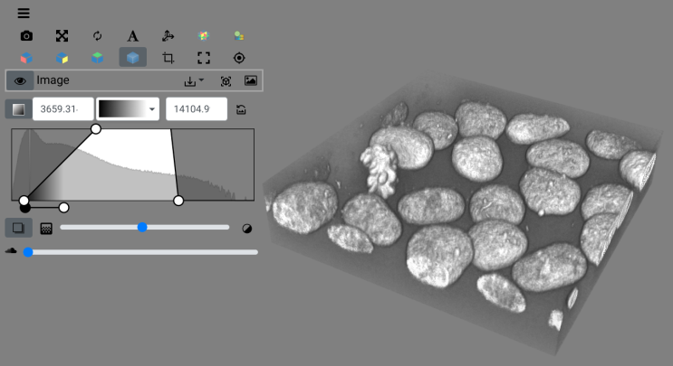

# nD Image Visualization with Open-Source Tools



This repository contains a few demo notebooks for creating interactive 3D visualizations using Python. 

- [↗️ PyVista Example](./pyvista_demo.ipynb)

- [↗️ Itkwidgets Example](./itkwidgets_demo.ipynb)

- [↗️ Dash VTK Example](./dash_demo.ipynb)


## Setup & Installation

Install the Python requirements:

```
pip install -r requirements.txt
```

Start jupyter lab from the terminal:

```
jupyter lab
```

## List of 3D image visualization tools

In addition to Jupyter notebook tools, many other 3D rendering software packages exist. Here are a few that we recommend (in alphabetical order):


- [Dash VTK](https://dash.plotly.com/vtk/intro)
- [Fiji - 3D viewer](https://imagej.net/plugins/3d-viewer/)
- [Fiji - Volume viewer](https://imagej.net/plugins/volume-viewer)
- [Itkwidgets](https://itkwidgets.readthedocs.io/en/latest/)
- [K3D](https://k3d-jupyter.org/index.html)
- [Napari](https://napari.org/stable/)
- [Neuroglancer](https://github.com/google/neuroglancer)
- [Paraview](https://www.paraview.org/)
- [PyVista](https://pyvista.org/)
- [stackview](https://github.com/haesleinhuepf/stackview)
- [tif2blender](https://github.com/oanegros/MicroscopyNodes)
- [vedo](https://vedo.embl.es/)
- [Viv](https://github.com/hms-dbmi/viv?tab=readme-ov-file)
- [Vizarr](https://github.com/hms-dbmi/vizarr)